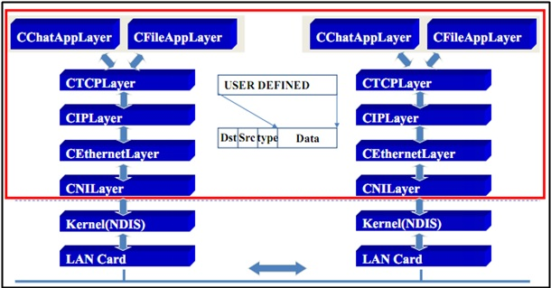
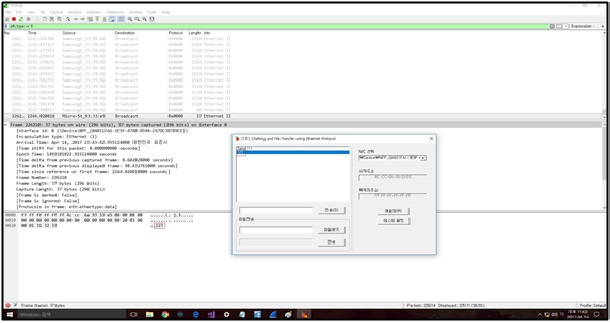
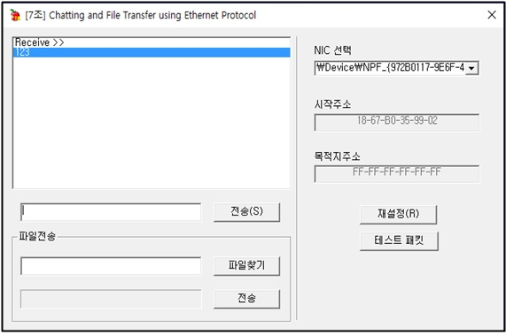
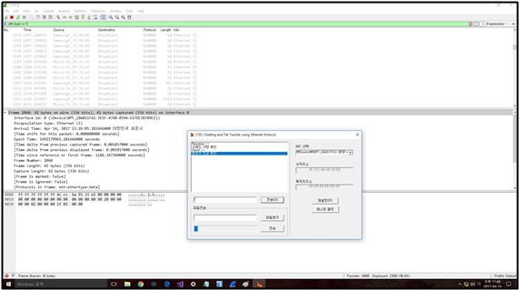

# chattingAndFileTransfer
Chatting and File Transfer using Ethernet Protocol

## 목적
이번 실습의 목적은 저번에 과제로 하였던 하나의 컴퓨터 내에서 프로세스 간의 통신에서 더 나아가 서로 다른 두개의 컴퓨터에서 서로 통신을 하는 것을 목적으로 하고 있다. 
Packet Driver를 이용해 네트워크로 연결된 두 PC사이에 채팅이나 파일을 전송한다. 이 과정들은 Thread를 이용해 구현되기 때문에 동시처리가 가능하다. 또한, 메시지나 파일의 크기의 제한 없이 전송될 수 있도록 Data Fragmentation기능을 구현한다.

1. IPCAppDlg : 이 계층은 프로그램의 전체적인 UI를 담당한다. 주로 송신에서는 계층을 만들고 연결하는 작업을 시작하며 ChatAppLayer에 입력받은 데이터를 전송을 한다. 수신에서는 마지막 패킷을 받을 때까지 수신과정을 반복하여 하나의 메시지로 합치고 전달받은 메시지를 화면에 출력한다. 

2. ChatAppLayer : 이 계층은 송신자가 입력한 메시지 패킷을 처리하는 과정을 진행하며 응용 계층이다. 송신에서는 ChatAppLayer의 header에 data(메시지)를 붙여서 하위계층인 TCPLayer에게 전체를 전달하고 다음 송신과정을 진행한다. 수신에서는 TCPLayer로부터 받은 데이터 중에서 ChatAppLayer의 header를 분리한다. 이후 상위계층인 IPCAppDlg로 메시지를 전달하여 프로그램의 화면에 전달받은 메시지가 출력되도록 한다.

3. FileAppLayer : 이 계층은 송신자가 지정을 한 파일을 처리를 하여 전송을 과정을 담당을 하는 응용계층이다. 송신에서는 FileLayer의 header에 data(파일 데이터)를 붙여서 하위계층인 TCPLayer로 전송을 한다. 이 때 전송을 하고자 하는 파일의 크기가 1472byte 보다 크다면 단편화를 하여서 여러 개의 Packet으로 나누어서 전송을 한다. 수신에서는 TCPLayer로부터 전해 받은 Packet들의 data들을 자신의 원하는 경로에 새로운 파일을 생성을 하여 저장을 한다. 이 때 크기가 큰 파일은 여러 개의 Packet으로 나누어져서 FileLayer 계층으로 들어올 수 있다. FileLayer계층에서는 Packet의 header부분의 정보를 확인을 하여 처음 중간 마지막 부분의 따라서 다르게 처리를 한다.   

4. TCPLayer : 이 계층은 송신자가 입력한 데이터를 처리하는 과정을 진행하며 전송 계층이다. 송신에서는 TCPLayer의 header에 data(메시지)를 붙여서 하위계층인 IPLayer에게 전체를 전달하고 다음 송신과정을 진행한다. 수신에서는 IPLayer로부터 받은 데이터 중에서 TCPLayer의 header를 분리한다. 이후 상위계층인 ChatAppLayer로 데이터를 전달을 한다. 특히 이 계층에서는 포트번호를 저장하는 필드를 따로 두어 송신에서는 port번호를 포함하여 전송하고, 수신에서는 port번호를 확인하여 패킷에 메시지가 들었는지 파일이 들었는지 구별한다. 만약 port번호가 0x2080이면 패킷에 메시지가 들어있으므로 헤더를 제외한 데이터를 ChatAppLayer로 보내고, port번호가 0x2090이면 파일을 전송한 것이므로 FileLayer로 보낸다.

5. IPLayer : 이 계층은 송신자가 입력한 데이터를 처리하는 과정을 진행하며 네트워크 계층이다. 송신에서는 IPLayer의 header에 data(메시지)를 붙여서 하위계층인 EthernetLayer에게 전체를 전달하고 다음 송신과정을 진행한다. 수신에서는 EthernetLayer로부터 받은 데이터 중에서 IPLayer의 header를 분리한다. 이후 상위계층인 TCP로 데이터를 전달을 한다.

6. EthernetLayer : 이 계층은 호스트간에 통신을 담당하는 계층으로 데이터 링크 계층이다. 송신에서는 IPLayer로부터 전달 받은 정보를 NILayer의 data(EthernetLayer header구조체의 enet_data필드)에 넣어서 하위계층인 NILayer에게 전체를 전송하고 다음 송신과정을 진행한다. 수신에서는 NILayer로부터 받은 데이터 중에서 Ethernet header를 분리한 Ethernet data부분(enet_data필드)를 상위계층인 IPLayer로 전달한다.

7. NILayer : 이 계층은 데이터를 패킷단위로 나누어서 네트워크로 연결된 다른 PC에 전송을 한다. 또한 수신에서는 연결된 네트워크로부터 받은 패킷들을 상위계층으로 보내준다. 

### Message Send

### Message Receive

### File Transfer

